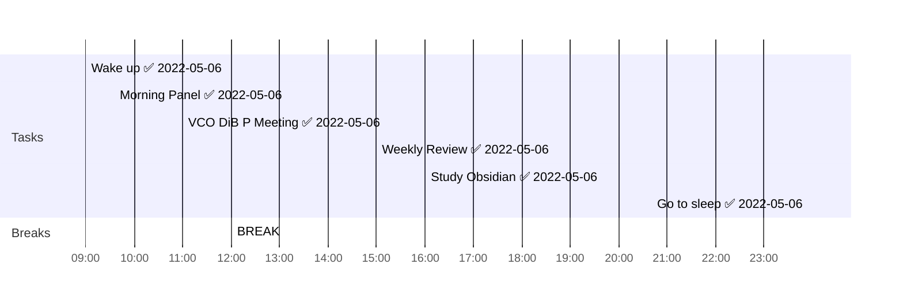

## Day Planner

- [x] 09:00 Wake up ✅ 2022-05-06
- [x] 09:35 Morning Panel ✅ 2022-05-06
- [x] 11:00 VCO DiB P Meeting ✅ 2022-05-06
- [x] 12:00 BREAK
- [x] 15:00 Weekly Review ✅ 2022-05-06
- [x] 16:00 Study Obsidian ✅ 2022-05-06
- [x] 23:55 Go to sleep ✅ 2022-05-06

## Reflections
1. Picked-up Obsidian again
2. Learned new stuff on Obsidian
	1. [[TP-Diary Template]]
	2. [[Obsidian Tasks]]
	3. [[Obsidian Admonition]]
	4. [[Obsidian Templater]]
	5. [[Obsidian Dataview]]
	6. [[Obsidian Annotator]]
	7. [[Obsidian Mindmap]]
	8. [[Obsidian YAML Syntax]] to specify meta data for files
	9. [[Obsidian - Taking Notes and Video Notes]]
	10. [[Obsidian Charts]]
	11. [Article:Obsidian Advanced Functionalities](https://mp.weixin.qq.com/s/MEPva7Os_nOyl1vgTBZTwQ)
3. 
4. 
  
