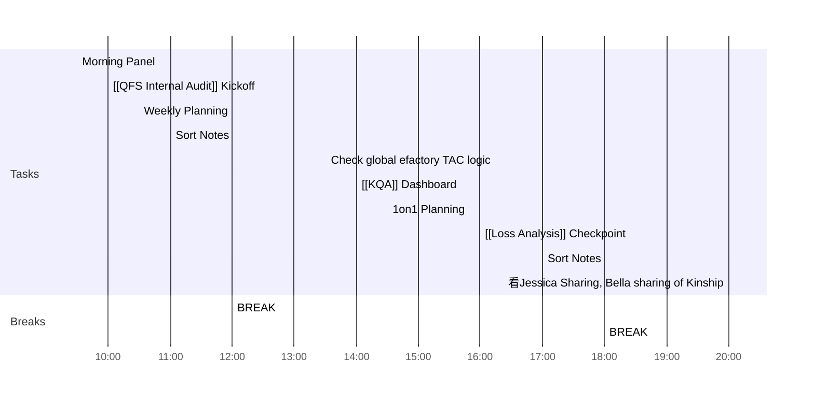

<< [[2022-05-08-星期日]] | [[2022-05-10-星期二]] >>
> Although there may be tragedy in your life, there's always a possibility to triumph. It doesn't matter who you are, where you come from. The ability to triumph begins with you. Always.
> — <cite>Oprah Winfrey</cite>

## Day Planner

- [x] 09:30 Morning Panel
- [x] 10:00 [[QFS Internal Audit]] Kickoff
- [x] 10:30 Weekly Planning
- [x] 11:00 Sort Notes
- [x] 12:00 BREAK
- [x] 13:30 Check global efactory TAC logic
- [x] 14:00 [[KQA]] Dashboard
- [x] 14:30 1on1 Planning
- [x] 16:00 [[Loss Analysis]] Checkpoint
- [x] 17:00 Sort Notes
- [x] 18:00 BREAK
- [x] 20:00 看Jessica Sharing, Bella sharing of Kinship

## Focus of this week
1. [[Loss Analysis]]
	1. Model
	2. Deck
2. [[KQA Dashboard]] update
3. Efactory upgrade

## Reflections
1. 
2. 
3. 
  
