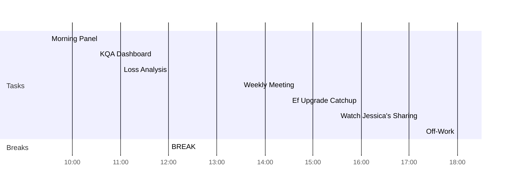

---
created: 2022-05-10 10:12
modified: 星期二 10日 五月 2022 10:12:18
tags: diary

---
<< [[2022-05-09-星期一]] | [[2022-05-11-星期三]] >>
> I have always thought the actions of men the best interpreters of their thoughts.
> — <cite>John Locke</cite>

## Day Planner

- [x] 09:30 Morning Panel
- [x] 10:30 KQA Dashboard
- [x] 11:00 Loss Analysis
- [x] 12:00 BREAK
- [x] 13:30 Weekly Meeting
- [x] 14:30 Ef Upgrade Catchup
- [x] 15:30 Watch Jessica's Sharing
- [x] 18:00 Off-Work
- [ ] 21:00Watched Jessica's Sharing and Sorted Notes on SPT, SIS, EC

## Reflections
1. 
2. 
3. 
  
