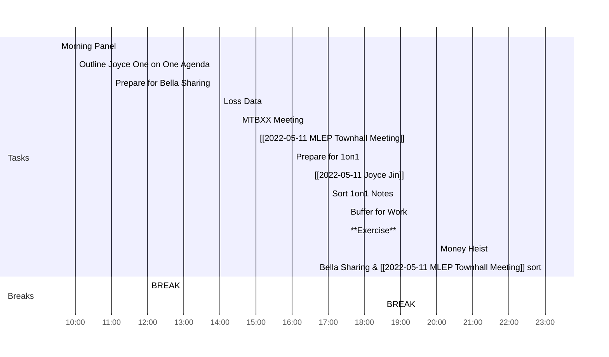

---
created: 2022-05-11 10:03
modified: 星期三 11日 五月 2022 10:03:35
tags: diary

---
<< [[2022-05-10-星期二]] | [[2022-05-12-星期四]] >>
> Keep your face always toward the sunshine - and shadows will fall behind you.
> — <cite>Walt Whitman</cite>

## Day Planner

- [x] 09:30 Morning Panel
- [x] 10:00 Outline Joyce One on One Agenda
- [x] 11:00 Prepare for Bella Sharing
- [x] 12:00 BREAK
- [x] 14:00 Loss Data
- [x] 14:30 MTBXX Meeting
- [x] 15:00 [[2022-05-11 MLEP Townhall Meeting]]
- [x] 16:00 Prepare for 1on1
- [x] 16:30 [[2022-05-11 Joyce Jin]]
- [x] 17:00 Sort 1on1 Notes
- [x] 17:30 Buffer for Work
- [x] 17:30 **Exercise**
- [x] 18:30 BREAK
- [x] 20:00 Money Heist
- [x] 23:00 Bella Sharing & [[2022-05-11 MLEP Townhall Meeting]] sort

## Reflections
1. 
2. 
3. 
  
