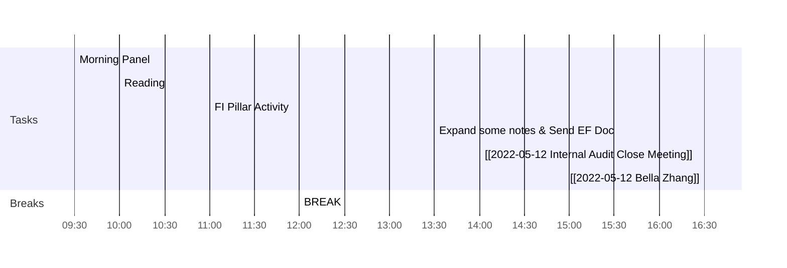

<< [[2022-05-11-星期三]] | [[2022-05-13-星期五]] >>
> One friend in a lifetime is much; two are many; three are hardly possible. Friendship needs a certain parallelism of life, a community of thought, a rivalry of aim.
> — <cite>Brooks Adams</cite>

## Day Planner

- [x] 09:30 Morning Panel
- [x] 10:00 Reading
- [x] 11:00 FI Pillar Activity
- [x] 12:00 BREAK
- [x] 13:30 Expand some notes & Send EF Doc
- [ ] 14:00 [[2022-05-12 Internal Audit Close Meeting]]
- [ ] 16:30 [[2022-05-12 Bella Zhang]]

## Reflections
1. 
2. 
3. 

## Fleeting Notes #todo/tolearn 
- [ ] PLG [[Product Led Growth]]

