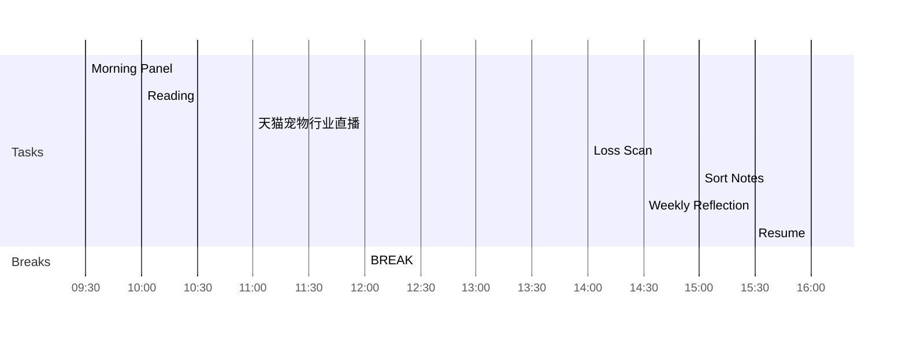

<< [[2022-05-12-星期四]] | [[2022-05-14-星期六]] >>
> Take things as they are. Punch when you have to punch. Kick when you have to kick.
> — <cite>Bruce Lee</cite>

## Day Planner

- [ ] 09:30 Morning Panel
- [ ] 10:00 Reading
- [ ] 11:00 天猫宠物行业直播
- [ ] 12:00 BREAK
- [ ] 14:00 Loss Scan
- [ ] 15:00 Sort Notes
- [ ] 15:30 Weekly Reflection
- [ ] 16:00 Resume

## Reflections
1. 
2. 

## Fleeting Notes #todo/tolearn 
- [ ] TGI
- [ ] CTR
- [ ] ISV
- [ ] https://www.sohu.com/a/162479005_601008
