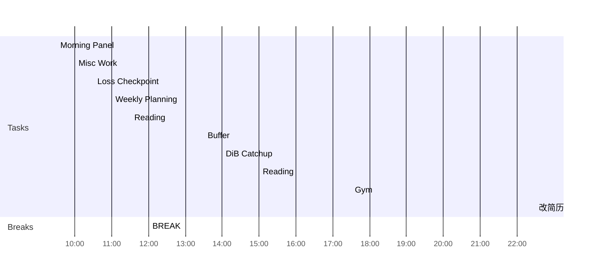

<< [[2022-05-15-星期日]] | [[2022-05-17-星期二]] >>
> Do not dwell in the past, do not dream of the future, concentrate the mind on the present moment.
> — <cite>Buddha</cite>

## Day Planner

- [ ] 09:30 Morning Panel
- [ ] 10:00 Misc Work
- [ ] 10:30 Loss Checkpoint
- [ ] 11:00 Weekly Planning
- [ ] 11:30 Reading
- [ ] 12:00 BREAK
- [ ] 13:30 Buffer
- [ ] 14:00 DiB Catchup
- [ ] 15:00 Reading
- [ ] 17:30 Gym
- [ ] 22:30 改简历

## Reflections
1. 
2. 
3. 

## Fleeting Notes #todo/tolearn 
- [ ] 找ashley要平均工资（问payroll
