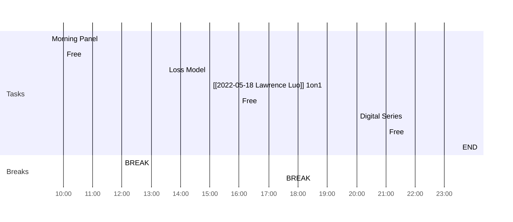

<< [[2022-05-17-星期二]] | [[2022-05-19-星期四]] >>
> Opportunity is missed by most because it is dressed in overalls and looks like work.
> — <cite>Thomas Edison</cite>

## Day Planner

- [ ] 09:30 Morning Panel
- [ ] 10:00 Free
- [ ] 12:00 BREAK
- [ ] 13:30 Loss Model
- [ ] 15:00 [[2022-05-18 Lawrence Luo]] 1on1
- [ ] 16:00 Free
- [ ] 17:30 BREAK
- [ ] 20:00 Digital Series
- [ ] 21:00 Free
- [ ] 23:30 END

## Reflections
1. 
2. 
3. 

## Fleeting Notes #todo/tolearn 
- [ ] 
