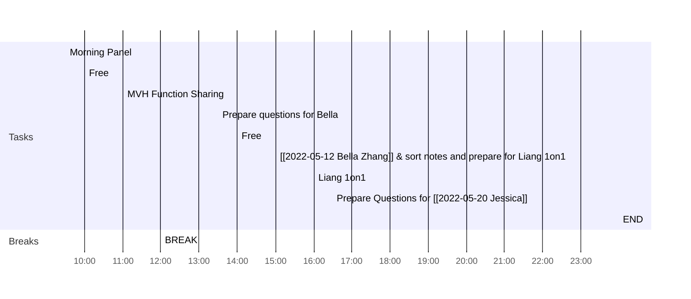

<< [[2022-05-18-星期三]] | [[2022-05-20-星期五]] >>
> There are two ways of spreading light: to be the candle or the mirror that reflects it.
> — <cite>Edith Wharton</cite>

## Day Planner

- [ ] 09:30 Morning Panel
- [ ] 10:00 Free
- [ ] 11:00 MVH Function Sharing
- [ ] 12:00 BREAK
- [ ] 13:30 Prepare questions for Bella
- [ ] 14:00 Free
- [ ] 15:00 [[2022-05-12 Bella Zhang]] & sort notes and prepare for Liang 1on1
- [ ] 16:00 Liang 1on1
- [ ] 16:30 Prepare Questions for [[2022-05-20 Jessica Wang]]
- [ ] 23:59 END

## Reflections
1. 
2. 
3. 

## Fleeting Notes #todo/tolearn 

