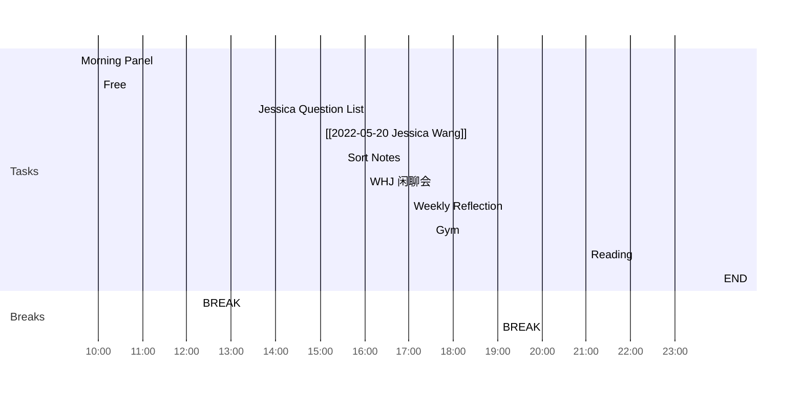

<< [[2022-05-19-星期四]] | [[2022-05-21-星期六]] >>
> You can only learn so much from books. You can only learn so much from education. Ultimately, it is the wisdom of God that will carry you through in the toughest situations of life.
> — <cite>Ravi Zacharias</cite>

## Day Planner

- [ ] 09:30 Morning Panel
- [ ] 10:00 Free
- [ ] 12:15 BREAK
- [ ] 13:30 Jessica Question List
- [ ] 15:00 [[2022-05-20 Jessica Wang]]
- [ ] 15:30 Sort Notes
- [ ] 16:00 WHJ 闲聊会
- [ ] 17:00 Weekly Reflection
- [ ] 17:30 Gym
- [ ] 19:00 BREAK
- [ ] 21:00 Reading
- [ ] 23:59 END

## MLEP志愿
1. Luke Digital Mkt/ offline SPT Mkt / 
2. Esther vet mkt / cumkt or pro mkt
3. HJ - HKTW / BJGZ
4. Leah - kinship commercial

## Fleeting Notes #todo/tolearn 

