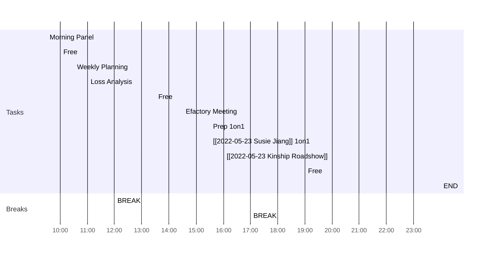

<< [[2022-05-22-星期日]] | [[2022-05-24-星期二]] >>
> There is nothing like returning to a place that remains unchanged to find the ways in which you yourself have altered.
> — <cite>Nelson Mandela</cite>

## Day Planner

- [ ] 09:30 Morning Panel
- [ ] 10:00 Free
- [ ] 10:30 Weekly Planning
- [ ] 11:00 Loss Analysis
- [ ] 12:00 BREAK
- [ ] 13:30 Free
- [ ] 14:30 Efactory Meeting
- [ ] 15:30 Prep 1on1
- [ ] 15:30 [[2022-05-23 Susie Jiang]] 1on1
- [ ] 16:00 [[2022-05-23 Kinship Roadshow]]
- [ ] 17:00 BREAK
- [ ] 19:00 Free
- [ ] 23:59 END

## Reflections
1. 
2. 
3. 

## Fleeting Notes #todo/tolearn 

