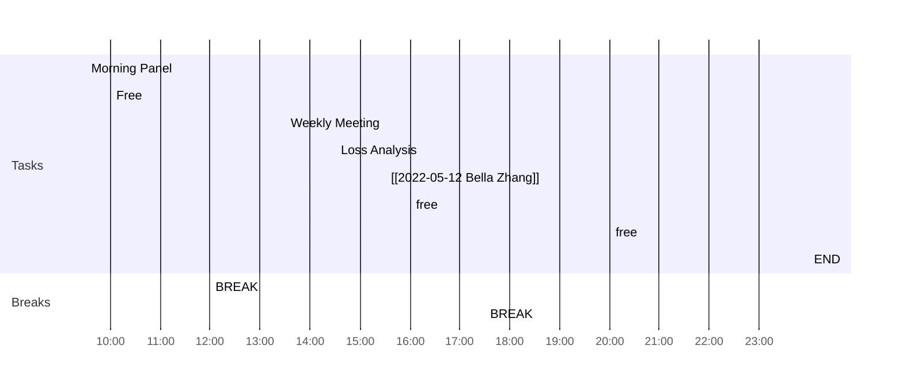

<< [[2022-05-23-星期一]] | [[2022-05-25-星期三]] >>
> Action is eloquence.
> — <cite>William Shakespeare</cite>

## Day Planner

- [ ] 09:30 Morning Panel
- [ ] 10:00 Free
- [ ] 12:00 BREAK
- [ ] 13:30 Weekly Meeting
- [ ] 14:30 Loss Analysis
- [ ] 15:30 [[2022-05-12 Bella Zhang]]
- [ ] 16:00 free
- [ ] 17:30 BREAK
- [ ] 20:00 free
- [ ] 23:59 END

## Reflections
1. 
2. 
3. 

## Fleeting Notes #todo/tolearn 
- [ ] create templates in OB with following thinking frameworks

